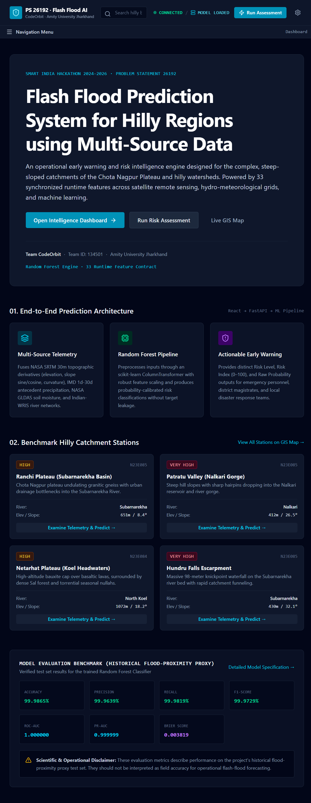
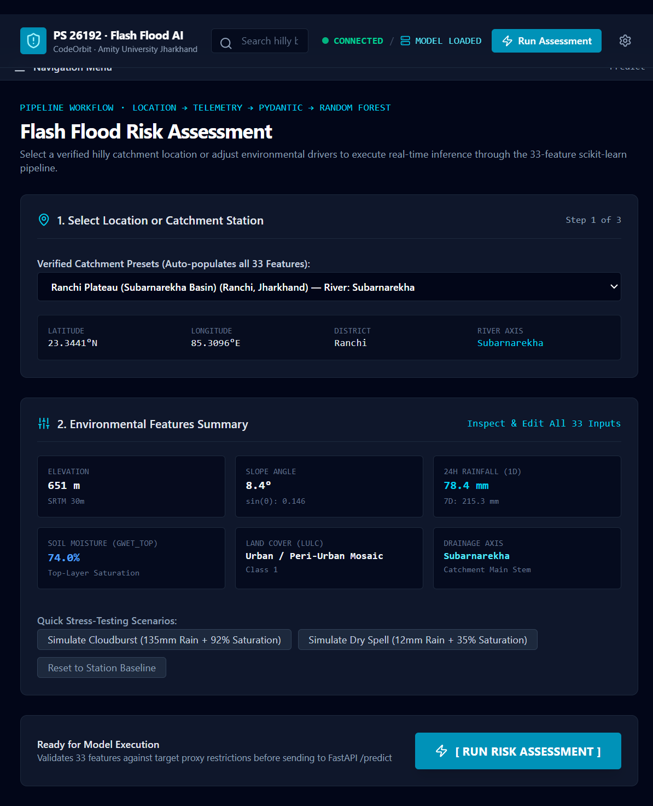
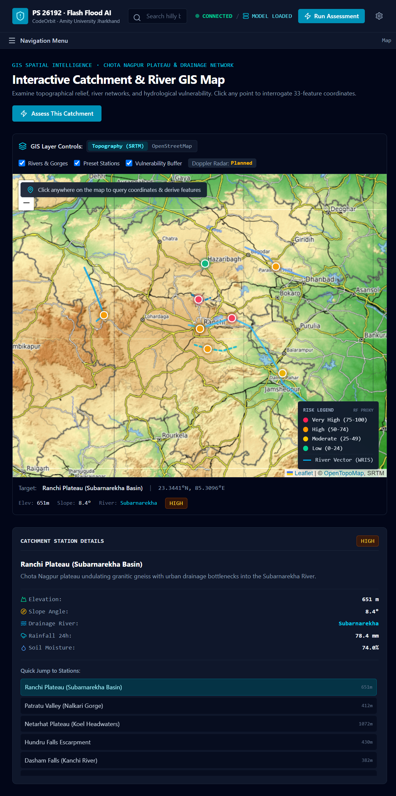
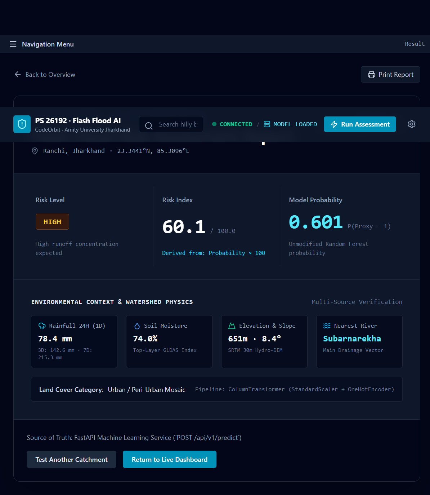
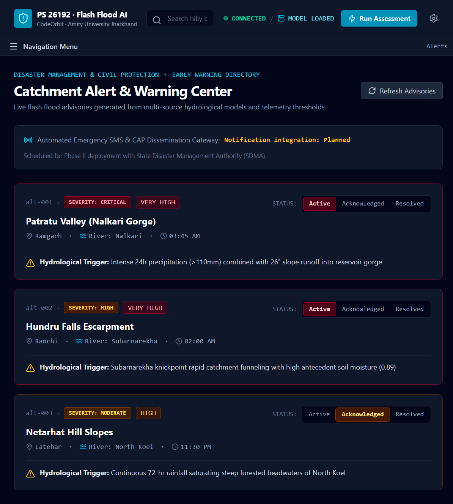

# 🌊 Flash Flood Prediction System

### AI-Based Flash Flood Prediction and Risk Monitoring for Hilly Regions

**Smart India Hackathon – Problem Statement 26192**

A full-stack disaster-intelligence and flood-risk decision-support platform designed to analyze multi-source environmental and geospatial data, perform machine-learning-based flood-risk assessment, and present the results through an interactive web dashboard and GIS-based visualization.

> **Build Principle:** Sense → Analyze → Predict → Map → Warn → Respond

---

## 🎯 Problem Statement

### PS 26192 — Flash Flood Prediction System for Hilly Regions using Multi-Source Data

Hilly and mountainous regions are vulnerable to sudden flooding due to changing environmental and geographical conditions such as rainfall, terrain, soil moisture, river characteristics, and other related factors.

The objective of this project is to develop a software-based decision-support system that combines:

- Multi-source environmental data
- Geospatial information
- Machine learning
- Risk assessment
- GIS visualization
- Interactive dashboards

to support flash-flood risk assessment and monitoring in vulnerable regions.

---

## 💡 Project Concept

The system follows an end-to-end prediction workflow:

```text
Multi-Source Data
       ↓
Feature Processing
       ↓
Machine Learning Model
       ↓
FastAPI Backend
       ↓
React Dashboard
       ↓
Risk Visualization
       ↓
GIS Map + Status / Warning
       ↓
Decision Support
```

The primary product flow is:

**DATA → FEATURE PROCESSING → ML PREDICTION → FASTAPI → REACT DASHBOARD → MAP + RISK VISUALIZATION → WARNING / DECISION SUPPORT**

---

## ✨ Key Features

### 📊 Risk Dashboard

Provides an overview of:

- Flood-risk assessment
- Environmental conditions
- Location information
- System status
- Risk indicators
- Map-based context

### 🤖 Machine Learning Prediction

The backend integrates a trained **Random Forest Classifier** with a fitted preprocessing pipeline.

The prediction workflow uses the project's verified **33 runtime environmental features**.

### 🗺️ GIS-Based Map

The system provides map-oriented visualization for:

- Selected locations
- Risk information
- Geographic context
- River/network context
- Location-specific assessment

### 📈 Historical Analysis

Provides historical and processed environmental/prediction context for analysis and comparison.

### ⚠️ Alerts / Warning Center

Provides risk assessment and warning/status information based on the application's prediction workflow.

The current prototype distinguishes assessment/status functionality from fully operational external notification systems.

### 🔍 Model Information

Provides transparency about:

- Machine learning model
- Preprocessing pipeline
- Input features
- Prediction workflow
- Model probability
- Risk Index
- Risk Level
- Evaluation metrics
- Model limitations

### 📍 Location-Based Assessment

Users can select/search for a location or interact with the map-based workflow before running a risk assessment.

---

# 🏗️ System Architecture

```text
                         USER
                           │
                           ▼
                 ┌──────────────────┐
                 │  React Frontend  │
                 │   Dashboard      │
                 │   GIS / Charts   │
                 └────────┬─────────┘
                          │
                       REST API
                          │
                          ▼
                 ┌──────────────────┐
                 │ FastAPI Backend  │
                 │ API + Validation │
                 └────────┬─────────┘
                          │
                          ▼
                 ┌──────────────────┐
                 │ Prediction       │
                 │ Service          │
                 └────────┬─────────┘
                          │
                          ▼
                 ┌──────────────────┐
                 │ Preprocessing    │
                 │ Pipeline         │
                 └────────┬─────────┘
                          │
                          ▼
                 ┌──────────────────┐
                 │ Random Forest    │
                 │ Classifier       │
                 └────────┬─────────┘
                          │
                          ▼
                 ┌──────────────────┐
                 │ Risk Processing  │
                 │ & Prediction     │
                 └────────┬─────────┘
                          │
                          ▼
                 ┌──────────────────┐
                 │ React Dashboard  │
                 │ Risk + Map +     │
                 │ Status           │
                 └──────────────────┘
```

---

# 🔄 Prediction Workflow

```text
1. Select / search a location
             ↓
2. Collect required environmental features
             ↓
3. Send prediction request to FastAPI
             ↓
4. Validate input using the API schema
             ↓
5. Apply the trained preprocessing pipeline
             ↓
6. Run the Random Forest model
             ↓
7. Generate prediction and model probability
             ↓
8. Calculate / process Risk Index
             ↓
9. Determine project-defined Risk Level
             ↓
10. Return result to the frontend
             ↓
11. Display result on dashboard / map
```

The prediction API uses the exact project-defined feature schema and separates **Risk Level**, **Risk Index**, and **Model Probability** rather than treating them as the same value.

---

# 🧠 Machine Learning Model

## Model

**Random Forest Classifier**

The supplied machine-learning package contains:

```text
Backend/model/
│
├── flash_flood_model.joblib
├── preprocessing_pipeline.joblib
├── feature_columns.json
└── final_test_metrics.json
```

### Model Components

| Component | Description |
|---|---|
| Algorithm | Random Forest Classifier |
| Runtime Features | 33 |
| Preprocessing | Fitted preprocessing pipeline |
| Model Format | Joblib |
| Feature Metadata | `feature_columns.json` |
| Evaluation Metrics | `final_test_metrics.json` |

### Prediction Output

The application keeps the following concepts separate:

- **Risk Level**
- **Risk Index**
- **Model Probability**

This distinction is important because a model probability should not be modified simply for visual presentation.

---

# ⚠️ Model Evaluation Note

The project's evaluation target is a **historical flood-proximity proxy** rather than field-confirmed flash-flood ground truth.

Therefore, the model evaluation metrics should **not** be interpreted as real-world operational flash-flood forecasting accuracy.

The final test-set metrics documented for the supplied model are:

| Metric | Value |
|---|---:|
| Rows | 22,264 |
| Accuracy | 0.999865 |
| Precision | 0.999639 |
| Recall | 0.999819 |
| F1 Score | 0.999729 |
| ROC-AUC | ~1.000000 |
| PR-AUC | ~0.999999 |
| Brier Score | 0.003819 |

These metrics describe performance on the project's historical flood-proximity proxy test set and should not be presented as field accuracy for operational flash-flood forecasting.

---

# 🌍 Data Sources

The project uses multiple historical, processed, and geospatial data sources.

### Environmental / Historical Sources

- Historical flood inventory
- CWC river-discharge observations
- Rainfall observations
- River-network spatial data
- SRTM elevation / DEM data
- Soil-moisture archives
- Environmental and terrain-related attributes

### Project Data Artifacts

Examples of supplied project data include:

```text
NER_Landslide_Final_Master_Dataset_Enriched.csv
India_Flood_Inventory_v3.csv
river_discharge_manual_daily_cwc_ap_2001_2025.csv
river_network.kml
rainfall_tel_hr_*.csv
SRTMGL3_354tiles.zip
2019_025deg_SMI.zip
2020_025deg_SMI.zip
2021_025deg_SMI.zip
2022_025deg_SMI.zip
2023_025deg_SMI.zip
2024_025deg_SMI.zip
```

These sources form the project's data/provenance boundary.

> **Important:** Historical or processed data must not be presented as live operational feeds unless a verified live integration is actually connected.

---

# 📡 Live Data Integration

The project architecture allows future integration with live environmental sources such as:

- IMD rainfall / forecast services
- CWC river information
- Satellite-based environmental products
- Soil-moisture products
- Flood-observation products
- Other approved environmental data services

However, a documented external source does **not** automatically mean that it is currently connected to the website.

The application should display a source as **Live** only when the corresponding integration is actually connected and healthy.

---

# 🖥️ Application Modules

| Module | Purpose |
|---|---|
| 🏠 Home / Landing | Introduces the project and prediction system |
| 📊 Dashboard | Provides overall risk and environmental overview |
| 🤖 Risk Prediction | Runs location-specific risk assessment |
| 🗺️ Interactive Map | Provides GIS-based geographic visualization |
| 📍 Location Details | Displays selected-location information |
| 📈 Historical Analysis | Provides historical environmental/prediction context |
| ⚠️ Alerts | Displays risk assessment and warning/status information |
| 📋 Prediction History | Displays previous prediction information where persistence is implemented |
| 🧠 Model Information | Explains model, features, metrics and limitations |
| ⚙️ Settings | Application configuration where implemented |

---

# 🛠️ Technology Stack

## Frontend

- React
- TypeScript
- Vite
- Tailwind CSS
- React-Leaflet
- Recharts
- Axios / API services

## Backend

- Python
- FastAPI
- Pydantic
- REST API

## Machine Learning

- Python
- Scikit-learn
- Random Forest
- Joblib
- Preprocessing Pipeline

## GIS / Visualization

- Leaflet
- React-Leaflet
- OpenStreetMap
- GeoJSON
- Geospatial data

## Development Tools

- Git
- GitHub
- Visual Studio Code

---

# 📁 Project Structure

```text
flash-flood-prediction/
│
├── Backend/
│   ├── main.py
│   ├── requirements.txt
│   │
│   └── model/
│       ├── feature_columns.json
│       ├── final_test_metrics.json
│       ├── flash_flood_model.joblib
│       └── preprocessing_pipeline.joblib
│
├── Frontend/
│   ├── src/
│   │   ├── components/
│   │   │   ├── common/
│   │   │   ├── dashboard/
│   │   │   ├── layout/
│   │   │   └── map/
│   │   │
│   │   ├── constants/
│   │   ├── hooks/
│   │   ├── pages/
│   │   ├── services/
│   │   ├── types/
│   │   ├── App.tsx
│   │   ├── index.css
│   │   └── main.tsx
│   │
│   ├── .env.example
│   ├── package.json
│   ├── index.html
│   ├── server.ts
│   ├── tsconfig.json
│   └── vite.config.ts
│
├── .gitignore
├── LICENSE
└── README.md
```

---

# ⚙️ Installation & Setup

## Prerequisites

Make sure the following are installed:

- Python 3.x
- Node.js
- npm
- Git

---

## 1. Clone the Repository

```bash
git clone https://github.com/Shambhavi05624/flash-flood-prediction.git
cd flash-flood-prediction
```

---

# 🐍 Backend Setup

Navigate to the backend:

```bash
cd Backend
```

Create a virtual environment:

```bash
python -m venv venv
```

### Windows

Activate the environment:

```bash
venv\Scripts\activate
```

### Install Dependencies

```bash
pip install -r requirements.txt
```

### Start FastAPI

```bash
uvicorn main:app --reload
```

The backend will normally be available at:

```text
http://127.0.0.1:8000
```

FastAPI documentation:

```text
http://127.0.0.1:8000/docs
```

---

# ⚛️ Frontend Setup

Open a new terminal.

Navigate to the frontend:

```bash
cd Frontend
```

Install dependencies:

```bash
npm install
```

Start the development server:

```bash
npm run dev
```

Open the local URL displayed by Vite in your browser.

---

# 🔌 API

The core prediction workflow uses the FastAPI backend.

### Health Check

```http
GET /health
```

### Prediction

```http
POST /api/v1/predict
```

The prediction request uses the project's exact 33-feature schema.

The backend:

1. Validates the request.
2. Applies the preprocessing pipeline.
3. Runs the Random Forest model.
4. Generates the prediction and probability.
5. Processes the risk result.
6. Returns the result to the frontend.

---

# 📊 Prediction Result

The application presents prediction results using separate concepts:

```text
┌──────────────────────────────┐
│       Prediction Result      │
├──────────────────────────────┤
│ Risk Level                   │
│ HIGH / MEDIUM / LOW          │
├──────────────────────────────┤
│ Risk Index                   │
│ Project-defined risk value   │
├──────────────────────────────┤
│ Model Probability            │
│ Model-generated probability  │
└──────────────────────────────┘
```

This prevents the model probability from being incorrectly presented as an independently measured flood-risk index.

---

# 🗺️ GIS & Location Workflow

The map-oriented workflow allows users to:

1. Search or select a location.
2. View geographic context.
3. Inspect available environmental information.
4. Run a risk assessment.
5. View the resulting risk information.
6. Display the assessment within the dashboard/map workflow.

The GIS layer is intended for decision support and visualization rather than claiming exact operational flood boundaries unless a validated boundary product is integrated.

---

# 🔐 Security & Development Practices

The project follows these implementation principles:

- Environment variables should be used for sensitive configuration.
- `.env` files should not be committed.
- `.env.example` can be used as a configuration template.
- Model files should remain protected on the backend.
- Training datasets should not be exposed through the public frontend.
- API requests should be validated.
- CORS should be configured appropriately.
- Production URLs should be supplied through environment variables.
- HTTPS and health monitoring should be used for production deployment.

---

# ⚠️ Prototype Limitations

This project is a **research/prototype decision-support system**.

It should not be interpreted as:

- A guaranteed flash-flood prediction system
- A replacement for official disaster-management authorities
- A system with 100% prediction accuracy
- A source of live rainfall or river telemetry unless the corresponding integration is actually connected
- An automatic disaster-alert system unless a real notification pipeline has been implemented and tested
- A system providing exact flood boundaries without a validated flood-boundary product

The model's evaluation target is a historical flood-proximity proxy and not field-confirmed flash-flood ground truth.

---

# 🚫 What the System Does Not Claim

To maintain responsible and technically accurate reporting, the project does **not** claim:

- Fake real-time rainfall data
- Fake river-discharge telemetry
- Fake sensor readings
- 100% accuracy
- Exact flood boundaries without validated data
- Automatic disaster notifications without an implemented notification pipeline
- That documented external data sources are automatically live
- That feature importance proves a direct causal relationship

---

# 🔮 Future Scope

The system can be extended with:

### 🌧️ Real-Time Environmental Data

- Live rainfall APIs
- Weather forecasts
- River telemetry
- Soil-moisture services

### 🛰️ Satellite Integration

- Near-real-time flood observations
- Satellite-derived environmental indicators
- Improved spatial monitoring

### 📱 Alerting

- SMS notifications
- Email notifications
- Mobile push notifications
- Authority notification workflows

### ☁️ Deployment

- Cloud deployment
- Separate frontend/backend hosting
- HTTPS
- Monitoring
- Automated health checks

### 🤖 Machine Learning

- Larger and more diverse datasets
- Model monitoring
- Periodic retraining
- Improved validation
- Additional model experimentation

### 🗺️ GIS

- More detailed spatial layers
- Administrative boundaries
- River-network improvements
- Advanced geospatial analysis

---

# 🧪 Testing

The project testing workflow includes checks for:

- Backend startup
- Model loading
- Prediction API
- Invalid input
- Missing features
- Incorrect data types
- Preprocessing failures
- Backend unavailability
- CORS configuration
- Frontend loading/error states
- End-to-end prediction workflow

Expected frontend states include:

```text
Empty:
"Select a location to begin."

Loading:
"Analyzing environmental conditions..."

Success:
"Risk assessment completed."

Error:
"Unable to generate assessment. Please try again."

Unavailable:
Explicitly identify the unavailable data source.
```

---

## 📸 Screenshots

### 📊 Dashboard



### 🤖 Risk Prediction



### 🗺️ Interactive Map



### 📈 Prediction Result



### ⚠️ Alerts / Warning Center



# 🎓 Smart India Hackathon

**Problem Statement:** PS 26192

**Title:** Flash Flood Prediction System for Hilly Regions using Multi-Source Data

**Team:** CodeOrbit

**Team ID:** 134501

**Institution:** Amity University Jharkhand

---

# 👥 Team

### Team CodeOrbit

- **Shekhar Sourav Pandey** — Team Leader
- **Kumari Shambhavi**
- **Rani Kumari**
- **Akshita**
- **Mohd Faraz Raziur Rab Siddique**
- **Shreya Shruti**

---

# 📜 License

This project is licensed under the **MIT License**.

See the [LICENSE](LICENSE) file for details.

---

# 🌊 Project Vision

The project aims to connect environmental data, machine learning, geospatial visualization, and a practical web interface into a unified flood-risk decision-support platform.

```text
Sense
  ↓
Analyze
  ↓
Predict
  ↓
Map
  ↓
Warn
  ↓
Respond
```

**Flash Flood Prediction System — PS 26192**
